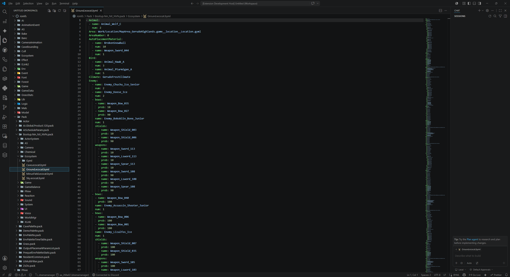

# totk-vscode

## Features

An extension for VSCode that adds TOTK file support. 
At the moment, you MUST have decompressed game files to edit them.

Current package support:
.pack

Current file support:
.byml
.bgyml

## Requirements

- Python 3.12
